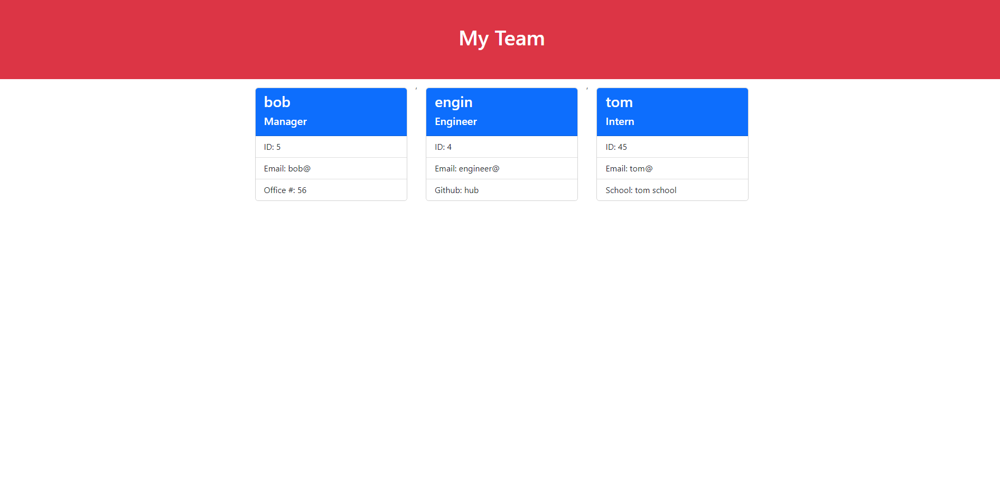

This is application is a team profile generator. The user will be prompted to answer a feq questions to know how many managers, engineer, and interns will be on the team.
The user will input information about each employee. Once the user has finished inputing the promps, the application will generate an HTML file that displays all the information about each team member.

The team profile generator can be found here: https://drive.google.com/file/d/1ZcsNd7dEczT2LavME-QqCkZeWnsq7e5R/view

An example of the team profile generator being used can be found here: https://mattflug.github.io/team-profile-generator/

